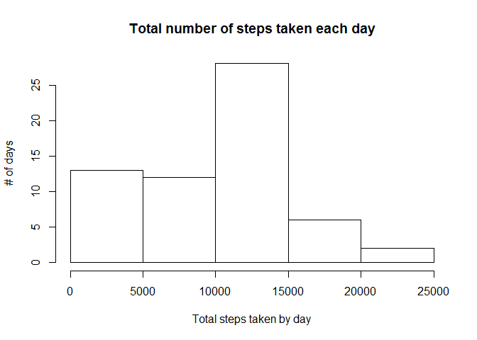
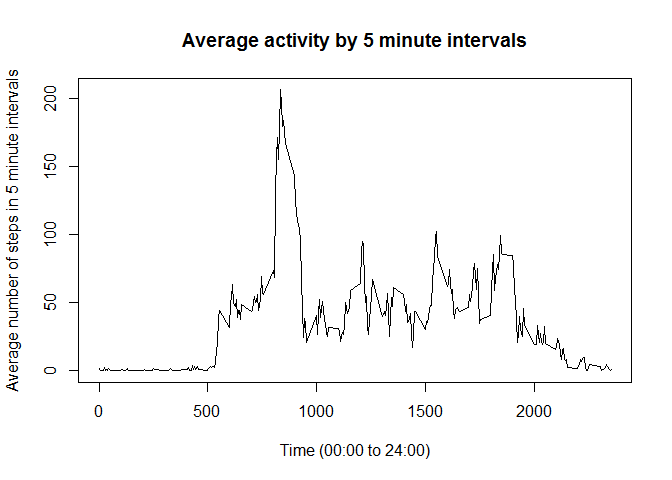
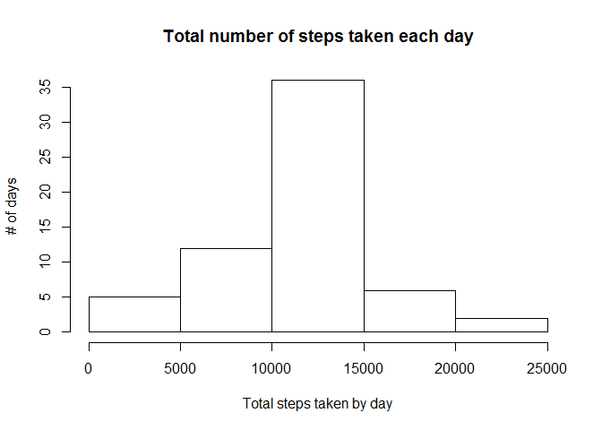
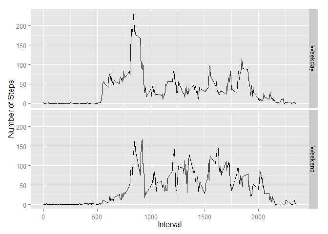

# Reproducible Research: Peer Assessment 1


## Loading and preprocessing the data

```r
library(dplyr)
```

```r
activityData <- read.csv("activity.csv", header=TRUE, na.strings = "NA")
activityData$date <- as.Date(activityData$date)
activityData<-tbl_df(activityData)
summary(activityData)
```

```
##      steps             date               interval     
##  Min.   :  0.00   Min.   :2012-10-01   Min.   :   0.0  
##  1st Qu.:  0.00   1st Qu.:2012-10-16   1st Qu.: 588.8  
##  Median :  0.00   Median :2012-10-31   Median :1177.5  
##  Mean   : 37.38   Mean   :2012-10-31   Mean   :1177.5  
##  3rd Qu.: 12.00   3rd Qu.:2012-11-15   3rd Qu.:1766.2  
##  Max.   :806.00   Max.   :2012-11-30   Max.   :2355.0  
##  NA's   :2304
```

## What is mean total number of steps taken per day?


```r
# arrange(summarise(group_by(PA1, date), sum(interval)), desc(date))
activityByDay<-summarise(group_by(activityData, date), dailyTotal = sum(steps, na.rm =TRUE))
hist(activityByDay$dailyTotal, main ="Total number of steps taken each day", 
     xlab = "Total steps taken by day", ylab = "# of days")
```

 

```r
dailyTotalMean <- mean(activityByDay$dailyTotal,na.rm =TRUE)
dailyTotalMedian <- median(activityByDay$dailyTotal,na.rm =TRUE)
print(paste("Daily Total Mean =", dailyTotalMean, "; Daily Total Median = ", dailyTotalMedian, sep =""))
```

```
## [1] "Daily Total Mean =9354.22950819672; Daily Total Median = 10395"
```

## What is the average daily activity pattern?


```r
activityByInterval<-summarise(group_by(activityData, interval), intervalMean = mean(steps, na.rm =TRUE))
plot(activityByInterval$interval, activityByInterval$intervalMean, type = "l",
     main = "Average activity by 5 minute intervals", 
     ylab = "Average number of steps in 5 minute intervals",
     xlab = "Time (00:00 to 24:00)")
```

 

## Imputing missing values

```r
#Total number of missing steps in the dataset
print(paste("Total number of missing numbers =", sum(is.na(activityData$steps))), sep="")
```

```
## [1] "Total number of missing numbers = 2304"
```

```r
#
lkpInterval <- activityByInterval$intervalMean
names(lkpInterval) <- activityByInterval$interval

# if (is.na(dT$steps[i])) lkp[[as.character(dT$interval[i])]] else dT$steps[i]
activityData2 <-activityData
for (i in seq_along(activityData2$steps)) 
    { activityData2$steps[i] <- if (is.na(activityData2$steps[i])) 
                                   lkpInterval[[as.character(activityData2$interval[i])]] 
                               else activityData2$steps[i]}

activityByDay2 <-summarise(group_by(activityData2, date), dailyTotal = sum(steps, na.rm =TRUE))
hist(activityByDay2$dailyTotal, main ="Total number of steps taken each day", 
     xlab = "Total steps taken by day", ylab = "# of days")
```

 

```r
dailyTotalMean2 <- mean(activityByDay2$dailyTotal,na.rm =TRUE)
dailyTotalMedian2 <- median(activityByDay2$dailyTotal,na.rm =TRUE)
print(paste("Daily Total Mean =", dailyTotalMean2, "; Daily Total Median = ", dailyTotalMedian2, sep =""))
```

```
## [1] "Daily Total Mean =10766.1886792453; Daily Total Median = 10766.1886792453"
```

```r
diffMeans <- dailyTotalMean2 - dailyTotalMean
diffMedian <- dailyTotalMedian2 - dailyTotalMedian

print(paste("The average daily Total is more by ", diffMeans, " as expected with all missing data filled.", 
            "The median of daily Total too have moved more towards the center and mean by ", diffMedian, ".", 
            "The histogram too looks more normal distribution, in lines with general expectaion of distribution of means. "))
```

```
## [1] "The average daily Total is more by  1411.95917104856  as expected with all missing data filled. The median of daily Total too have moved more towards the center and mean by  371.188679245282 . The histogram too looks more normal distribution, in lines with general expectaion of distribution of means. "
```


## Are there differences in activity patterns between weekdays and weekends?


```r
library(ggplot2)
```

```r
activityData2 <- mutate(activityData2, dayFlag = ifelse( weekdays(as.Date(activityData2$date, "%Y-%m-%d")) 
                                                         %in% c("Saturday", "Sunday"), "Weekend", "Weekday"))

activityByInterval2 <- summarise(group_by(activityData2, dayFlag, interval), intervalMean = mean(steps, na.rm =TRUE))

qplot(interval, intervalMean, data=activityByInterval2, geom = "line", facets=dayFlag~., 
      xlab = "Interval", ylab = "Number of Steps")
```

 
